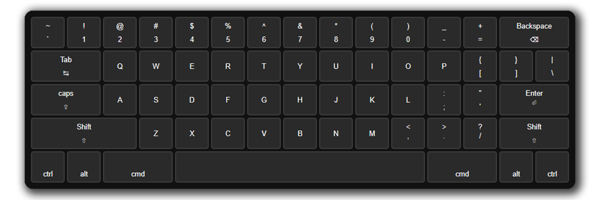

<!-- TYPING GAME LOGO -->
 

  

  <h3 align="center">Typing Game</h3>

  

    A minimal, customizable typing game for the browser.
     
    
     
     
    
    &middot;
    
  

<!-- TABLE OF CONTENTS -->

  
Table of Contents

  <ol>
    <li>
      <a href="#about-the-project">About The Project</a>
      <ul>
        <li><a href="#web-app-languages">Web-App Languages</a></li>
      </ul>
    </li>
    <li>
      <a href="#setup">Setup</a>
      <ul>
        <li><a href=#prerequisite>Prerequisite</a>
        <li><a href=#start-up-steps>Start-up Steps</a>
      </ul>
    </li>
    <li><a href="#contributing">Contributing</a></li>
      <ul>
       <li><a href="#contributors">Contributors</a></li>
      </ul>
    <li><a href="#roadmap">Roadmap</a></li>
    <li><a href="#contact">Contact</a></li>
  </ol>

<!-- ABOUT THE PROJECT -->
## About The Project

[![Placeholder Image][product-screenshot]](https://github.com/La-Colaborativa/Typing-Game/images/window-screenshot.png)

A typing game made for La Colaborativa to help the youth and elders who want to learn the proper form and methods of typing.

### Web-App Languages

Here is the front-end stack that was used for this project.

  

<!-- SETUP -->
## Setup

Quick and concise way of starting the application up on your end.

### Prerequisite
* Installed Visual Studio Code
    - Other IDEs may function, but this was built solely on Visual Studio Code.
* Download the "Live Server" extension within Visual Studio Code.
    - Essential as it will not port the needed modules (word-bank) and won't update in real time.

### Start-up Steps
* Open in Visual Studio Code.
* Right-click the "index.html" file and hit "Open with Live Server" button (should be on top of list).
* You will see a new browser tab open. Begin using web-application.
    - Any saved changes will be active and refresh the web-app automatically.

<!-- CONTRIBUTING -->
## Contributing

1. Fork the Project
2. Create your Feature Branch
3. Commit your Changes
4. Push to the Branch
5. Open a Pull Request

## Contributors

### Art Contributor
Thank you to Drake for the art used in this project. Reach out if you would like to make commissions. He is in the <a href="#contact">Contact</a> section. 

### GitHub Contributors

<!-- ROADMAP -->
## Roadmap

Ideas to be integrated. Concepts are added as the project continues.

- [ ] Additional Options:
    - [ ] WPM Tracker

See the [open issues](https://github.com/La-Colaborativa/Typing-Game/issues) for a full list of known issues and proposed features.

<!-- CONTACT -->
## Contact

- Modesto Rodriguez - modestomazzoni@gmail.com
- Nelson
- Drake Henry - (aathiallll@gmail.com)

Project Link: [https://github.com/La-Colaborativa/Typing-Game/](https://github.com/La-Colaborativa/Typing-Game/)

(<a href="#readme-top">back to top</a>)

<!-- Markdown Images -->
[product-screenshot]: images/window-screenshot.png
